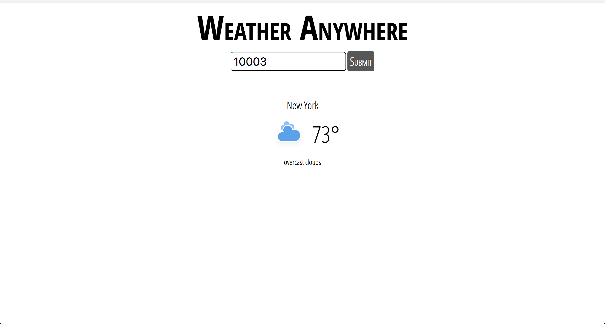

# Weather app

Let's build a weather application, which allows the user to input a zip code and get the weather for their location.

Here's a mock-up that you should aim for:

## A few high-level notes

- Always use class names for CSS. No element selectors, no IDs.
- There are **animated images** for the various weather states in the `images/` folder

## Steps

1. We'll use the OpenWeatherMap API to look up weather data. [Sign up for an account](https://openweathermap.org/api) 
1. Use this sort of URL to query weather data:

    https://api.openweathermap.org/data/2.5/weather?zip=THE_USERS_ZIP_CODE_HERE,us&units=imperial&appid=YOUR_API_KEY_HERE

  Note you'll have to supply your API key as well as the zip code the user has input.
1. There's a bit of starter code in the HTML and CSS file. Take a look and get started! Try to match the mock-up as close as you can.

## Bonus

- Add a five day forecast with their [5 day forecast endpoint](https://openweathermap.org/forecast5)
